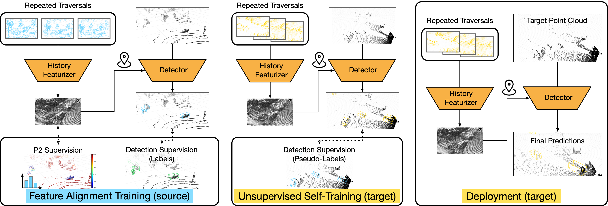

# Unsupervised Domain Adaptation for Self-Driving from Past Traversal Features

This is the official code release for [[ICML BRAVO 2023] Unsupervised Domain Adaptation for Self-Driving from
Past Traversal Features ](https://openaccess.thecvf.com/content/ICCV2023W/BRAVO/papers/Zhang_Unsupervised_Domain_Adaptation_for_Self-Driving_from_Past_Traversal_Features_ICCVW_2023_paper.pdf).

by Travis Zhang*, Katie Z Luo*, Cheng Perng Phoo, Yurong You, Wei-Lun Chao, Bharath Hariharan, Mark Campbell, Kilian Q. Weinberger



## Abstract
The rapid development of 3D object detection systems for self-driving cars has significantly improved accuracy. However, these systems struggle to generalize across diverse driving environments, which can lead to safety-critical failures in detecting traffic participants. To address this, we propose a method that utilizes unlabeled repeated traversals of multiple locations to adapt object detectors to new driving environments. By incorporating statistics computed from repeated LiDAR scans, we guide the adaptation process effectively. Our approach enhances LiDAR-based detection models using spatial quantized historical features and introduces a lightweight regression head to leverage the statistics for feature regularization. Additionally, we leverage the statistics for a novel self-training process to stabilize the training. The framework is detector model-agnostic and experiments on real-world datasets demonstrate significant improvements, achieving up to a 20-point performance gain, especially in detecting pedestrians and distant objects.

## Citation
```
@InProceedings{Zhang_2023_ICCV,
    author    = {Zhang, Travis and Luo, Katie and Phoo, Cheng Perng and You, Yurong and Chao, Wei-Lun and Hariharan, Bharath and Campbell, Mark and Weinberger, Kilian Q.},
    title     = {Unsupervised Domain Adaptation for Self-Driving from Past Traversal Features},
    booktitle = {Proceedings of the IEEE/CVF International Conference on Computer Vision (ICCV) Workshops},
    month     = {October},
    year      = {2023},
    pages     = {4040-4046}
}
```

## Environment Setup
Setup with an anaconda environment:
```bash
conda create --name hist-da python=3.8
conda activate hist-da
conda install pytorch=1.9.0 torchvision torchaudio cudatoolkit=11.1 -c pytorch -c nvidia
pip install opencv-python matplotlib wandb scipy tqdm easydict scikit-learn pillow==8.3.2
```

Since Hist-DA is built off of the [OpenPCDet framework](https://github.com/open-mmlab/OpenPCDet), make sure to install its dependencies. 

```
# Minowski Engine
git clone https://github.com/NVIDIA/MinkowskiEngine.git
cd MinkowskiEngine
git checkout c854f0c # 0.5.4
# NOTE: need to run this on a node with GPUs
python setup.py install

# install customized spconv
cd third_party/spconv
python setup.py bdist_wheel
cd ./dist
pip install spconv-1.2.1-cp38-cp38-linux_x86_64.whl

# install openpcdet
cd ../../../downstream/OpenPCDet
pip install -r requirements.txt
python setup.py develop

# for managing experiments
pip install hydra-core --upgrade
pip install hydra_colorlog --upgrade
pip install rich
```

## Running Hist-DA

### Preprocessing Data
Please refer to [`downstream/OpenPCDet/data_preprocessing/lyft/LYFT_PREPROCESSING.md`](./downstream/OpenPCDet/data_preprocessing/lyft/LYFT_PREPROCESSING.md) and [`downstream/OpenPCDet/data_preprocessing/ithaca365/ITHACA365_PREPROCESSING.md`](./downstream/OpenPCDet/data_preprocessing/ithaca365/ITHACA365_PREPROCESSING.md) for more information.

### Precomputing p2 Scores
Make sure that the paths in the previous sections are correct since calculating the p2 scores require certain references in the previous sections.

#### Lyft P2 Score Generation:
```
cd $PROJECT_ROOT_DIR
python p2_score/pre_compute_p2_score.py
```

#### Ithaca365 P2 Score Generation:
```
cd $PROJECT_ROOT_DIR
python p2_score/pre_compute_p2_score.py dataset="ithaca365" data_paths="ithaca365.yaml"
```

Make sure to modify the field `load_p2_score` in both the [lyft model config](downstream/OpenPCDet/tools/cfgs/lyft_models/pointrcnn_hindsight_p2_squashlevel.yaml) and [ithaca365 model config](downstream/OpenPCDet/tools/cfgs/ithaca365_models/pointrcnn_hindsight_p2_squashlevel.yaml)

### Training on Source Domain
First, go to this directory: `cd downstream/OpenPCDet/tools`.
Then, you can run the following command to train on source data
```
scripts/dist_train.sh <NGPUS> --cfg_file cfgs/<SOURCE_DOMAIN>_models/pointrcnn_hindsight_p2_squashlevel.yaml
```

### Generate pseudolabels
Go to the outer scripts directory by calling: `cd ../../scripts/` and then running `generate_pl_<target_domain>.sh`

**Note**: Before running these bash scripts, make sure the following arguments are correct based on the type of pseudolabels you are trying to generate. The current default values should allow you to generate pseudolabels for our main experimental results

```
- source_domain: the source domain you trained your model on
- target_domain: the target domain you want to generate pseudolabels for
- target_model: the name of the eval cfg in the target domain to generate predictions on the training set
- source_model: the name of the eval cfg in the source domain that you trained your model on 
- pl_output: name of the folder to store the pseudolabels (pl)
```

### Finetune on target data
Once the pseudolabels are generated, you can run the following command to finetune:
```
scripts/dist_train.sh <NGPUS> --cfg_file cfgs/<TARGET_DOMAIN>_models/pointrcnn_hindsight_p2_squashlevel.yaml --ckpt <SAVED_SOURCE_DOMAIN_WEIGHTS> --set DATA_CONFIG.DATA_PATH <PSEUDOLABEL DIRECTORY>
```

### Evaluation on target data
You can run the following command for evaluation:
```
scripts/dist_test.sh <NGPUS> --cfg_file cfgs/<TARGET_DOMAIN>_models/pointrcnn_eval_hindsight_car_pedestrian.yaml --ckpt <SAVED_TARGET_DOMAIN_WEIGHTS>
```

## Model Checkpoints
We provide the checkpoints for both source domain models and the final finetuned Hist-DA in both Ithaca365 and Lyft target domains.

### Source Models
| Model | Source Domain | Checkpoint  | Config file |
| ----- | ----- | :----: | :----: |
| PointRCNN + Hindsight | Ithaca365 | [link](https://drive.google.com/file/d/1-qCwXo1sHaK9CreRvJEKqm3TNOI4lsWq/view?usp=sharing) | [cfg](downstream/OpenPCDet/tools/cfgs/lyft_models/pointrcnn_hindsight_p2_squashlevel.yaml) |
| PointRCNN + Hindsight | Lyft | [link](https://drive.google.com/file/d/1cZUC6o59JLLSGxwZCYWjXYI8Sh6JPdAt/view?usp=sharing) | [cfg](downstream/OpenPCDet/tools/cfgs/ithaca365_models/pointrcnn_hindsight_p2_squashlevel.yaml) |

### Finetuned models on Target Domain
| Model | Target Domain | Checkpoint  | Config file |
| ----- | ----- | :----: | :----: |
| PointRCNN + Hindsight | Ithaca365 | [link](https://drive.google.com/file/d/1FNIICnEf16F3OPSnpHv4GwdlSQ5ersFR/view?usp=sharing) | [cfg](downstream/OpenPCDet/tools/cfgs/ithaca365_models/pointrcnn_hindsight_p2_selftraining_squashlevel.yaml) |
| PointRCNN + Hindsight | Lyft | [link](https://drive.google.com/file/d/1ln6Cqv5Qmtnv4wYbil8fYZop6rmqEz29/view?usp=sharing) | [cfg](downstream/OpenPCDet/tools/cfgs/lyft_models/pointrcnn_hindsight_p2_selftraining_squashlevel.yaml) |
